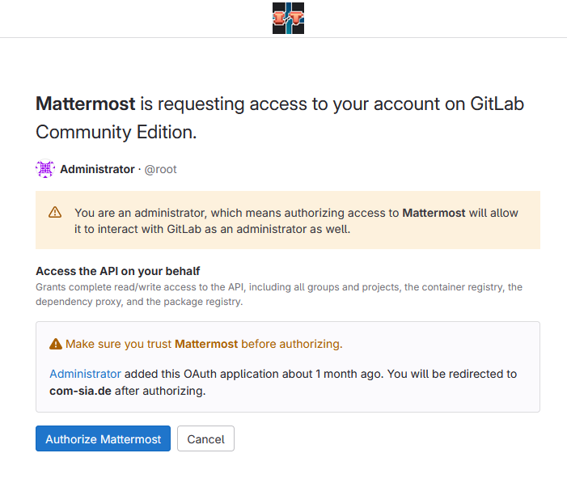

# Mattermost

[Mattermost](https://mattermost.com/) ist ein Open-Source Instant-Messaging-Dienst.  
Die Fachschaft Informatik betreibt eine eigene Instanz unter [https://com-sia.de](https://com-sia.de)

Neben der Webseite gibt es auch Apps für [Android](https://play.google.com/store/apps/details?id=com.mattermost.rn), [iOS](https://apps.apple.com/us/app/mattermost/id1257222717), [Windows, macOS und Linux](https://mattermost.com/download/#desktop).

## Anmeldung bei Mattermost

Die Authentifizierung bei Mattermost wird über die eigene [GitLab](../gitlab) Instanz der Fachschaft Informatik durchgeführt.

Zuerst muss ein Account auf der [GitLab](../gitlab) Instanz angelegt werden. Hierzu reicht es auf den GitLab Knopf auf der Anmeldeseite zu klicken.

!!! warning "Achtung"
	Es ist nur möglich sich mit einem Account auf der [GitLab](../gitlab) Instanz der Fachschaft Informatik anzumelden.    
	Andere GitLab Instanzen werden nicht unterstützt.

??? note
	Der "Du hast kein Konto?" Knopf leitet auf eine Fehlerseite weiter.     
	Es ist nicht möglich sich direkt auf der Mattermost Instanz zu registrieren.

Nach drücken des Knopfs wird automatisch auf die Anmeldeseite der GitLab Instanz weitergeleitet. Hier kann ein Account angelegt werden oder ein bestehender Account verwendet werden.

<!--<figure markdown="span">-->
{ width="45%" }
{ width="45%" }
<!--</figure>-->
Nach erfolgreicher Anmeldung auf der GitLab Instanz muss Mattermost noch die Erlaubnis erteilt werden auf die GitLab Daten zuzugreifen. Hierzu muss auf den "Authorize Mattermost" Knopf gedrückt werden.

Nach erfolgreicher Autorisierung wird der Nutzer automatisch auf die Mattermost Instanz weitergeleitet und kann den Dienst nutzen.

<!--## Einen Raum erstellen

## Einem Raum beitreten

## Eine Gruppe erstellen-->